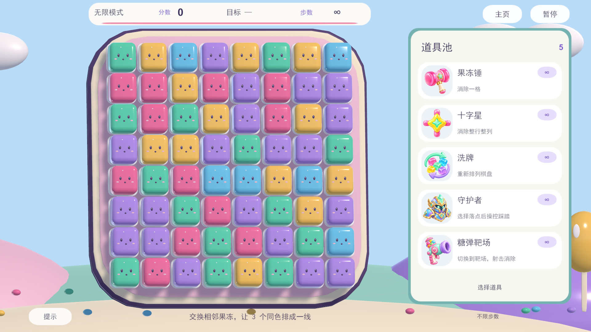

# ruanjian · Jelly World

课程小组协作的 Unity 益智消除游戏工程。

**当前是可在 Unity Editor 中运行的源码工程，还不是已发布的网页版。** 网页版需要安装 WebGL Build Support、导出构建，再部署到静态网站。仓库已包含导出菜单，见 [团队接手说明](Docs/TEAM_HANDOFF.md)。



## 打开工程

1. 安装 Git 和 Unity Hub，克隆仓库：

   ```bash
   git clone https://github.com/lyc20060601/ruanjian.git
   ```

2. 在 Unity Hub 中添加仓库根目录。工程版本为 **Unity 2022.3.42f1c1**，记录在 `ProjectSettings/ProjectVersion.txt`。
3. 等待 Unity 还原依赖并导入素材，打开 `Assets/Scenes/JellyWorld.unity`，点击 Play。

已包含完整 `Assets`、`Packages`、`ProjectSettings` 和 `.meta` 文件，不需要原作者的 `Library` 缓存。

## 当前功能

- 12 个逐步解锁关卡：从 6×6 / 4 色到 10×10 / 7 色。
- 积分、颜色收集和清冰目标；进度、星级、最高分保存。
- 相邻交换、三连消除、连锁、补位、按住拖动及动画期间预输入。
- 果冻锤、十字光束、洗牌、守护者、糖弹靶场；无限模式。
- 守护者跑动、蓄力跳跃、第一／第三人称、两段碎冰。
- 独立靶场场景、糖弹射击、返回后同步棋盘。
- 本地排行榜、暂停、音效设置。

进度与排行榜是本机数据，不是联网账号或全服排行榜。

## 操作

| 场景 | 操作 |
| --- | --- |
| 棋盘 | 点击相邻两格，或按住鼠标拖动 |
| 守护者 | WASD 移动、Shift 跑动、空格蓄力跳跃、F 重踏 |
| 视角 | V 切换；第一人称移动鼠标；Tab 释放鼠标 |
| 靶场 | 鼠标瞄准，按住左键发射 |
| 暂停 | Esc |

## 协作与后续交付

每项工作新建分支，完成后通过 Pull Request 合并；场景、预制体与素材必须连同 `.meta` 提交。缓存和个人作业提交包不应进入仓库。

- [团队接手、模块划分与 WebGL 发布步骤](Docs/TEAM_HANDOFF.md)
- [玩法及实现说明](Assets/JellyWorld/README.md)
- [第三方素材和字体](THIRD_PARTY_NOTICES.md)
- [素材选用规则](AGENTS.md)

**网页版下一步：**安装 WebGL 模块 → 执行 `Jelly World > Build WebGL` → 浏览器验证 `Builds/WebGL` → 发布到 GitHub Pages 等静态托管服务。目前还没有浏览器游玩 URL。
